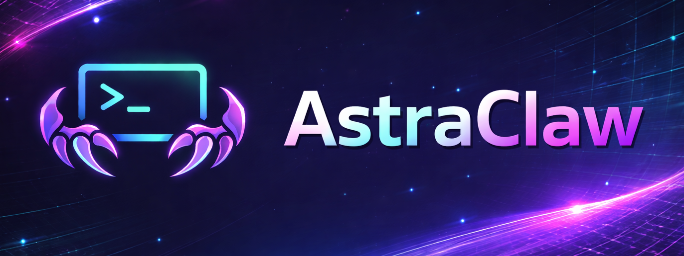

<p align="center">
  
</p>

<p align="center">
  <a href="https://github.com/Rahat-Kabir/astra-claw/actions/workflows/tests.yml">
    
  </a>
  <a href="LICENSE">
    
  </a>
  
</p>

# Astra-Claw

A terminal-first AI agent for local development workflows. It can inspect files, edit code, run shell commands, search previous sessions, and use optional web tools from a lightweight CLI.

## Who It's For

Astra-Claw is for developers who want a personal agent in the terminal that can help with real repo work without hiding the tool loop.

It is best suited for:
- local development workflows
- repo exploration and code changes
- iterative terminal-based collaboration
- users who want visible tool usage and session history

It is not designed as:
- a secure sandbox
- a hosted multi-user platform
- a background autonomous production agent
- a replacement for reviewing shell commands and code changes

## What It Does

- Conversational AI agent with a tool-calling loop
- Light Rich/prompt_toolkit CLI with history, slash commands, and autocomplete
- Reads, writes, and surgically edits files via `read_file`, `write_file`, and `patch`
- Runs shell commands via `shell` with dangerous-command approval
- Searches files via `search_files` for content or filenames
- Searches the web via `web_search` and extracts pages via `web_extract` (Tavily-backed, hidden unless `TAVILY_API_KEY` is set)
- Searches past sessions via `session_search` for recent work or older fixes
- Plans multi-step work via `todo` (session-scoped task list, re-injected after context compaction)
- Asks one clarifying question via `clarify` when a request is ambiguous (multiple-choice or open-ended, CLI-only)
- Persists interactive sessions as JSONL transcripts with auto-generated 3-5 word titles (daemon-thread, silent-fail)
- Streams responses as tokens arrive
- Supports OpenAI and OpenRouter
- Retries once on a fallback provider/model for transient LLM failures
- Groups tools by `toolset` and filters unavailable tools before exposing schemas to the model
- Persistent memory across sessions via `MEMORY.md` (agent notes) and `USER.md` (user profile), injected into the system prompt as a frozen snapshot
- Global `SOUL.md` persona file loaded from `~/.astraclaw/SOUL.md` as the primary identity layer
- Persistent context compaction for long sessions with manual `/compact` and automatic preflight compaction
- Workspace fence: `--workspace <path>` locks `write_file` and `patch` to a single directory tree for safe sandbox testing
- Live CLI feedback: dim dots spinner while thinking, one compact line per tool call with result summary (line counts, `+N -M` diff deltas, shell exit codes), errors in red

## Safety And Limitations

Astra-Claw is a local developer tool, not a secure sandbox.

Important boundaries:
- `shell` is powerful and can run arbitrary terminal commands
- dangerous shell commands require explicit user approval
- `--workspace <path>` fences `write_file` and `patch` to a single directory tree
- `read_file` and `shell` are not fenced by `--workspace`
- web tools are optional and only appear when `TAVILY_API_KEY` is set
- `clarify` is CLI-only and depends on an interactive callback

Practical implications:
- use Astra-Claw in repos and directories you trust
- use `--workspace` when you want safer file-edit testing
- review shell actions and file changes before treating them as final
- do not treat the current workspace fence as full isolation

## Quick Start

```bash
git clone https://github.com/Rahat-Kabir/astra-claw.git
cd astra-claw
python -m venv venv
.\venv\Scripts\Activate.ps1    # Windows PowerShell
# source venv/bin/activate     # Linux / macOS / Git Bash
pip install -e .
```

Set your API key:

```bash
# PowerShell
$env:OPENAI_API_KEY = "sk-..."

# Bash
export OPENAI_API_KEY="sk-..."
```

Optional web tools:

```bash
# PowerShell
$env:TAVILY_API_KEY = "tvly-..."

# Bash
export TAVILY_API_KEY="tvly-..."
```

Run:

```bash
python -m astra_claw
```

## Usage

Interactive mode starts a new session and saves every turn:

```text
$ python -m astra_claw
╭──────────── Astra-Claw ────────────╮
│ Session   2026-04-10_a1b2c3d4      │
│ Commands  /help                    │
╰────────────────────────────────────╯

astra> hey
Hello! How can I help you?
```

Built-in local commands: `/help`, `/sessions`, `/new`, `/compact`, `/exit`, `/quit`.

Resume a session:

```text
$ python -m astra_claw --session 2026-04-10_a1b2c3d4
Resumed session: 2026-04-10_a1b2c3d4
Loaded 4 messages.
```

List recent sessions:

```text
$ python -m astra_claw --sessions
```

One-shot mode does not save a session:

```text
$ python -m astra_claw "read README.md and summarize it"
```

Lock the agent to a sandbox directory for safe testing:

```text
$ python -m astra_claw --workspace d:/PROJECT/sandbox
╭──────────── Astra-Claw ────────────╮
│ Session   2026-04-14_abcd1234      │
│ Workspace d:\PROJECT\sandbox       │
│ Commands  /help                    │
╰────────────────────────────────────╯
```

`write_file` and `patch` reject any resolved path outside the workspace (relative escapes, absolute paths, or `~`). `read_file` and `shell` are not fenced and still run relative to the chdir'd cwd.

## Project Structure

```text
astra-claw/
|-- astra_claw/
|   |-- __main__.py           # entry point (interactive, one-shot, --session, --sessions)
|   |-- constants.py          # get_astraclaw_home()
|   |-- config.py             # config loading + defaults
|   |-- llm.py                # provider routing, client creation, fallback policy
|   |-- session.py            # JSONL session persistence
|   |-- memory.py             # MemoryStore - persistent memory (MEMORY.md + USER.md)
|   |-- soul.py               # SOUL.md loader + first-run seeding
|   |-- cli/
|   |   |-- commands.py       # slash command registry + autocomplete
|   |   |-- repl.py           # prompt_toolkit interactive loop + AgentEvents wiring
|   |   |-- tool_display.py   # pure preview + result-summary helpers for tool feedback
|   |   `-- ui.py             # Rich output helpers + thinking spinner + tool line
|   |-- agent/
|   |   |-- context_compactor.py # history compaction rules + token estimation
|   |   |-- events.py         # AgentEvents dataclass (on_thinking/tool_start/tool_complete)
|   |   |-- streaming.py      # stream iteration + on_thinking + context-overflow detection
|   |   |-- tool_runner.py    # one-batch tool dispatch with event hooks
|   |   |-- title_generator.py # auto-generates session titles on a daemon thread
|   |   |-- loop.py           # AstraAgent - core conversation loop + preflight compaction
|   |   `-- prompt_builder.py # system prompt assembly (SOUL.md + memory snapshot)
|   `-- tools/
|       |-- registry.py       # tool registry with toolsets and availability filtering
|       |-- path_safety.py    # shared write fence, protected path, and atomic write helpers
|       |-- file_tools.py     # read_file, write_file tools
|       |-- patch_tool.py     # exact text replacement tool with diff output
|       |-- shell_tool.py     # shell command execution
|       |-- search_tool.py    # file search (content + filename)
|       |-- web_tools.py      # Tavily-backed web_search + web_extract
|       |-- session_search_tool.py # cross-session recall over JSONL session history
|       |-- memory_tool.py    # memory tool (add/replace/remove)
|       |-- todo_tool.py      # session todo list (plan + track tasks)
|       `-- clarify_tool.py   # ask one clarifying question via the CLI callback
|-- tests/
|   |-- agent/               # mocked agent loop tests
|   |-- cli/                 # slash command and REPL tests
|   |-- tools/               # tool-level tests
|   |-- test_features.py     # core regression tests
|   |-- test_soul.py         # SOUL.md seeding and loading tests
|   `-- test_session.py      # session persistence tests
|-- docs/
|   |-- tech_spec.md         # technical design notes
|   |-- progress.md          # implementation progress log
|   `-- testing.md          # test commands and suite layout
`-- pyproject.toml
```

## Configuration

User data lives in `~/.astraclaw/` by default:

```text
~/.astraclaw/
|-- config.yaml
|-- SOUL.md
|-- sessions/
|-- memory/
|-- skills/
`-- logs/
```

`SOUL.md` is seeded automatically on first run if it does not already exist. Edit it to change Astra-Claw's default identity and tone globally.

Override defaults by creating `~/.astraclaw/config.yaml`:

```yaml
model:
  default: gpt-5.4-mini
  provider: openai
  fallback_provider: openrouter
  fallback_model: gpt-5.4-mini
  context_window: 128000
agent:
  max_turns: 30
compression:
  enabled: true
  threshold_ratio: 0.8
  reserve_tokens: 4000
  keep_first_n: 2
  keep_last_n: 6
  max_passes: 2
tools:
  enabled_toolsets:
    - filesystem
    - terminal
    - web
    - memory
memory:
  enabled: true
  user_profile_enabled: true
  memory_char_limit: 2200
  user_char_limit: 1375
session:
  auto_title: true   # generate a short title after the first exchange
```

If `tools.enabled_toolsets` is omitted, all registered and available tools are exposed.

`web_search` and `web_extract` are exposed only when `TAVILY_API_KEY` is set.

Fallback retries only apply to transient/runtime failures such as timeouts, connection errors, rate limits, and 5xx responses. Auth and bad-request errors do not fail over.

Context compaction rewrites long interactive session transcripts after archiving the old JSONL, so resumed sessions replay the compacted history instead of the full original middle.

`session_search` adds JSONL-based cross-session recall: empty query lists recent sessions; non-empty query runs a two-pass reranked search over session titles and message content, with current-session exclusion.

## Testing

Run the full suite:

```bash
python -m pytest tests -v
```

For focused test commands and suite layout, see `docs/testing.md`.

## License

MIT
